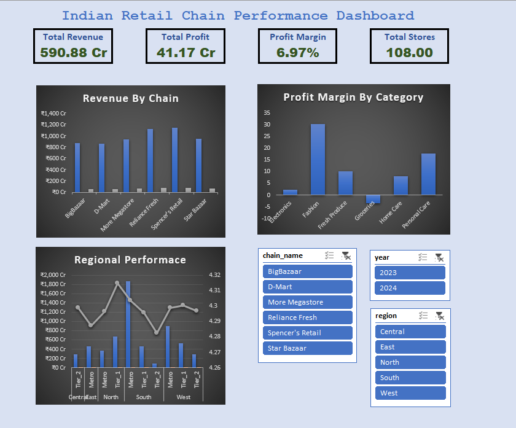

# 🇮🇳 Indian Retail Performance Analysis

  
*A comprehensive data analytics project by [Ayush Singhal](https://github.com/Ayushhhhhhhh)*

[ **Live Demo**](https://ayushhhhhhhh.github.io/3_Indian-Retail-Analysis/)

---

## 📋 **Project Overview**

This project delivers a deep-dive analysis into the sales, profitability, and operational efficiency of major Indian retail chains.  
The goal: **Transform raw transactional data into actionable business intelligence** for identifying key performance drivers, growth opportunities, and areas needing improvement.

The analysis culminates in a professional, executive-ready dashboard that visualizes these insights.

---

## 📊 **Dashboards**

### [**Final Power BI Dashboard**](#)

### [**Excel Analysis Dashboard**](#)

---

## ✨ **Key Analyses & Features**

-  **Executive KPIs:** High-level tracking of Total Revenue, Total Profit, and Overall Profit Margin.
-  **Chain Performance:** Comparative analysis of retail chains based on sales, profitability, and customer count.
-  **Category Deep-Dive:** Identification of most and least profitable categories (e.g., Fashion, Groceries).
-  **Geographic Insights:** Regional performance analysis highlighting the sales dominance of the South Region.
-  **Store-Level Analysis:** Top 10 and bottom 10 performing stores.

---

## 🛠️ **Tech Stack & Tools**

| Tool                | Usage                                                                                 |
|---------------------|---------------------------------------------------------------------------------------|
| **Python**          | Data cleaning, preprocessing, EDA, key visualizations                                 |
| **Pandas**   **NumPy** | Data manipulation and analysis                                                      |
| **Matplotlib**   **Seaborn** | Advanced charting and visualizations                                          |
| **SQL**             | Aggregations, querying, and extracting business insights                              |
| **Microsoft Excel** | Initial data mockups & dashboard prototyping (Pivot Tables)                           |
| **Microsoft Power BI** | Final, interactive, executive-ready dashboard                                      |

---

## 🚀 **Get Started**

Explore the [Live Demo](https://ayushhhhhhhh.github.io/3_Indian-Retail-Analysis/)  
Dive into the dashboards and discover actionable insights driving Indian retail success!

---

> **Crafted with passion for analytics & retail by Ayush Singhal**  
> 